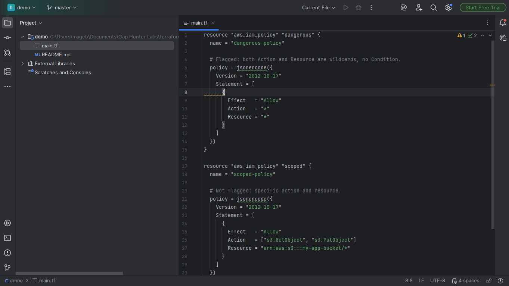
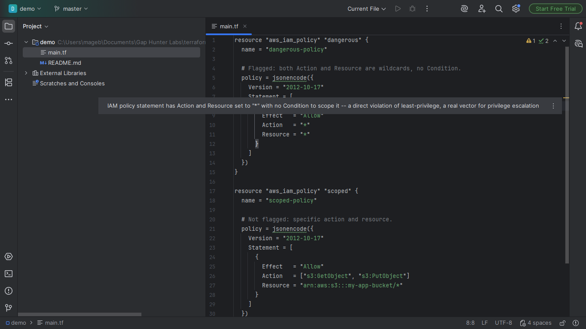

# Terraform IAM Wildcard Companion

Warning on an IAM policy statement (inside a Terraform
`aws_iam_policy`/`aws_iam_role_policy` resource's `jsonencode({...})`
block) whose `Action` or `Resource` is `"*"` with no `Condition`
scoping it down.

## Screenshots





## Why it exists

A direct violation of least-privilege, documented as a dedicated check
by tfsec (`no-policy-wildcards`) and Tenable -- a real vector for
privilege escalation in cloud incidents. tfsec/Policy Sentry are
external CLI tools; no dedicated Marketplace plugin does this as an
inline IDE inspection.

## Why built this way

- **Not a JSON parser** -- despite the name `jsonencode`, its argument
  is an HCL map/list literal (evaluated to a JSON string only at
  Terraform apply time). Walked directly via brace/bracket balancing
  that respects string literals, no Terraform/HCL PSI dependency (the
  platform bundles none for a Kotlin-only plugin).
- Handles both `Action`/`Resource` string form (`Action = "*"`) and
  list form (`Action = ["s3:*", "*"]`).

## v0.1 scope — stated honestly, not exhaustively

Only the direct HCL pattern (`jsonencode({...})` embedded directly in
the resource) -- never follows a policy loaded from an external
`.json` file via `file(...)`.

## Usage

Open any `.tf` file with an `aws_iam_policy`/`aws_iam_role_policy`
resource. A statement with an unscoped wildcard shows a warning on its
line.

## Enterprise / Team Licensing

Need enterprise features, custom rules, or team licensing? Contact us at
**gaphunterlabs@gmail.com**.

## Development

```
./gradlew test           # unit tests
./gradlew buildPlugin    # generates build/distributions/*.zip
./gradlew verifyPlugin   # checks compatibility against real IDEs
```

## License

Apache-2.0. See `LICENSE`.
